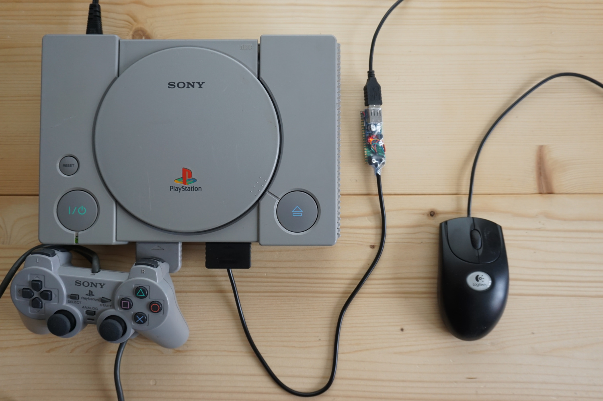
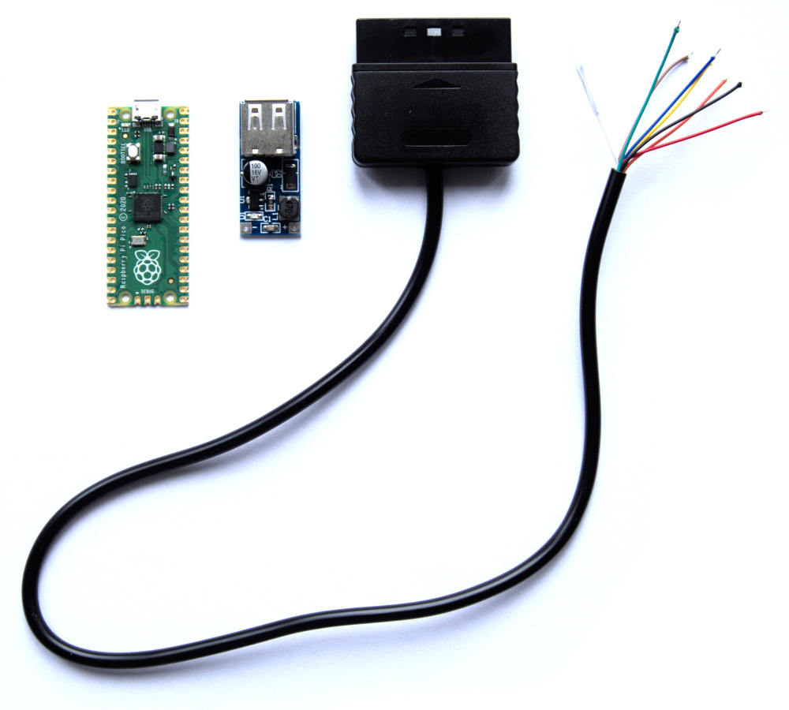
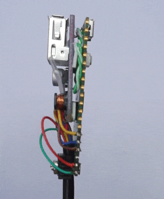

# USB to PlayStation Mouse

To build the adapter, the following components are necesary:
* PlayStation controller cable with connector
* Raspberry Pi Pico
* Mini PFM Control DC-DC USB 0.9V-5V to 5V dc Boost Step up Power Module

The cable has colored wires, but color coding is not guaranteed and has to be checked with a multimeter in continuity mode. Unused wires have to be isolated. A good way to do this is putting a thin heat shrink tube over a folded wire with isolation intact.

The components are to be wired as follows:

Make sure the two PCBs are well isolated from each other.

Uploading the firmware is done in the usual manner, i.e. the Pi is connected via a Micro-USB cable while BOOTSEL button is pressed. The Pi appears as USB flash drive and usb_to_ps1_mouse.uf2 is copied to it. USB mouse must not be connected to the adapter while programming (obviously).

## Notes
* This is an early version of the adapter, so issues may appear. It is recommended to watch this project so that you catch all upcoming updates and fixes.
* When connecting the adapter to a PS1 that is already on, USB mouse must be connected to the adapter first and 
then the adapter should be connected to PS1.
* To test the adapter, no special game is needed, because the mouse works in the PlayStation system menu that appears when there is no game in the CD drive. Also, it can be tested with an ordinary audio CD (see youtube link below). For this test, PS1 controller should be disconnected.
* Known issues:
  * Not every USB mouse is compatible with the adapter at the moment, but most ordinary ones should work.

## Links

https://youtu.be/NdH5DYy-4_E

https://hackaday.com/2022/07/12/pi-pico-provides-practical-playstation-pointing/
